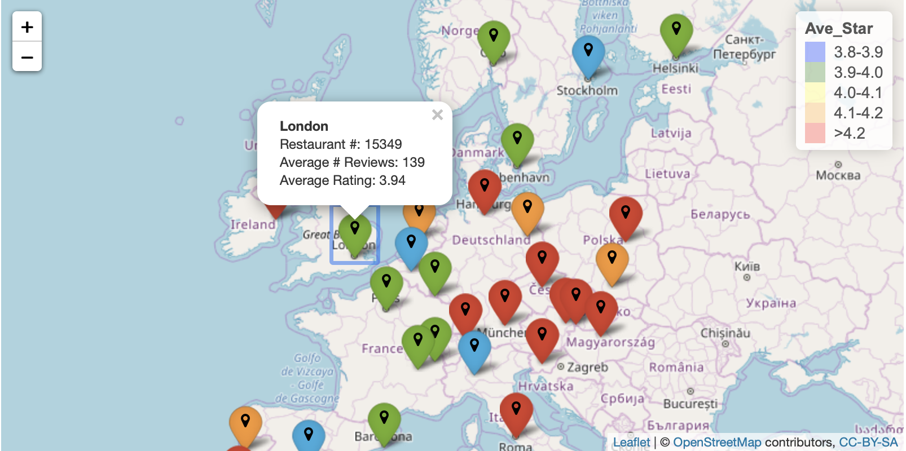
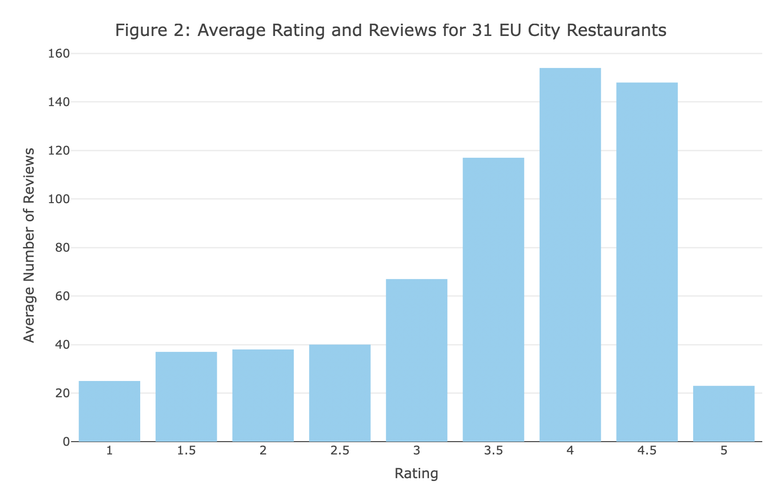

```{r setup, include=FALSE}
knitr::opts_chunk$set(echo = TRUE)
pacman::p_load(
  "data.table",
  "ggplot2",
  "knitr",
  "plotly",
  "readxl",
  "tidyr",
  "dplyr",
  "zoo",
  "esquisse",
  "matlab",
  "lattice",
  "benford.analysis",
  "grid",
  "gridExtra",
  "tidytext",
  "wordcloud",
  "tm",
  "stringr",
  "leaflet"
)
```


##Overview

This project took European restaurant data from TripAdvisor as the main data sourse and conducted analysis on restaurant ratings and reviews. Major techniques applied in the analysis are data cleaning using **dplyr**, Benford's Law analysis using **benford.analysis**, data visualization using **plotly** and **ggplot**, text mining using **tidytext** and **wordcloud**, mapping using **leaflet**.

A Shiny app and a powerpoint generated by **office** are created along with this report.


##Data Cleaning

The major dataset was collected from Kaggle$^{[1]}$. The dataset was obtained by scrapping the ratings and reviews for restaurants across 31 European cities from TripAdvisor.

Another dataset containing geolocation information of the cities was collected from Simplemaps World Cities Database$^{[2]}$.

The original data contains 125527 records of restaurants from 31 European cities. After filtering out NAs, the remaining dataset contains 108178 records. 


```{r readdata,warning=FALSE,echo=FALSE,message=FALSE}
#read data
data<-fread("TA_restaurants_curated.csv")
#select variables
data1<-data%>%dplyr::select(Name,City,Rating,`Number of Reviews`,Reviews)
#clear out NAs
data1<-na.omit(data1)
#data1<-data1%>%filter(Rating>0)
data1<-data1%>%separate(Reviews, c("Reviews", "Review_Date"),"]")%>%dplyr::select(-Review_Date)
```


```{r prep_bfd,warning=FALSE,echo=FALSE,message=FALSE}

leading<-extract.digits(data$`Number of Reviews`, number.of.digits = 2,
                   sign="positive", second.order = FALSE, discrete=TRUE, round=3)
data2<-cbind(data1,leading$data.digits)
colnames(data2)[colnames(data2) == "V2"] <- "leading_digit"

data3<-data2%>%filter(`Number of Reviews`<10)

data4<-data2%>%filter(`Number of Reviews`>9 )

```

```{r prep_text,warning=FALSE,echo=FALSE,message=FALSE}

one_star<-data1%>%filter(Rating<2)%>%dplyr::select(Reviews)
two_star<-data1%>%filter(Rating<3&Rating>1.5)%>%dplyr::select(Reviews)
three_star<-data1%>%filter(Rating<4&Rating>2.5)%>%dplyr::select(Reviews)
four_star<-data1%>%filter(Rating<5&Rating>3.5)%>%dplyr::select(Reviews)
five_star<-data1%>%filter(Rating>4.5)%>%dplyr::select(Reviews)
```

```{r prep_map,warning=FALSE,echo=FALSE,message=FALSE}
location<-fread("worldcities.csv")
location<-location%>%dplyr::select(2:4)
colnames(location)<-c("City","lat","lng")
City_Info <- data1 %>% group_by(City) %>% summarise(
n = n(),
Ave_Star = mean(Rating),
Ave_NReview = mean(`Number of Reviews`))


City_Info<-left_join(City_Info,location,by = "City")
#copenhagen Oporto
City_Info[17,5]<-55.676098
City_Info[17,6]<-12.568337
City_Info[46,5]<-41.14961
City_Info[46,6]<--8.61099
CityMap<-rbind(City_Info[1,],City_Info[3,],City_Info[10:11,],City_Info[14:18,],City_Info[22:23,],City_Info[27,],City_Info[29:31,],City_Info[33,],City_Info[35,],City_Info[38:41,],City_Info[45:48,],City_Info[53:54,],City_Info[57:58,],City_Info[61,],City_Info[63,])

CityMap$Ave_Star<-round(CityMap$Ave_Star, digits = 2)
CityMap$Ave_NReview<-round(CityMap$Ave_NReview, digits = 0)

CityMap<-CityMap%>%mutate(color= ifelse(Ave_Star<3.9,"blue",
                                        ifelse(Ave_Star<4.0 & Ave_Star>=3.9,"green",
                                               ifelse(Ave_Star<4.1 & Ave_Star>=4.0,"yellow",
                                                      ifelse(Ave_Star<4.2 & Ave_Star>=4.1,"orange","red")))))
```

##Map

The map visualization using **leaflet** provides an overview of the geographically information of the cities from the dataset and allows interaction to view the total number of restaurant, average rating and average number of reviews.


```{r mapimage, echo=FALSE, fig.pos="H", out.width = '100%'}

```


Figure 1 provides an overview of the map. Red markers are the cities with higher average restaurant rating. Please check ShinyApp for more interactive function.

```{r map,warning=FALSE,echo=FALSE,message=FALSE}


CityMap$popup <- with(CityMap, paste("<b>", City, "</b>","<br />","Restaurant #:" ,n,"<br />","Average # Reviews:" ,Ave_NReview,"<br />","Average Rating:" ,Ave_Star,"<br />"))

markers <- awesomeIcons(
    icon='map-marker',
    iconColor = "Black",
    markerColor = CityMap$color,
    library='fa')

leg<-data.frame(Ave_Star=c("3.8-3.9","3.9-4.0","4.0-4.1","4.1-4.2",">4.2"),col=c("blue","green","yellow","orange","red"))
m <- leaflet(data = CityMap, width = "100%" ) %>%
    addTiles() %>%  # Add default OpenStreetMap map tiles
    addAwesomeMarkers(
        lng = ~lng, 
        lat = ~lat, 
        popup = ~popup,
        icon = markers
    ) %>%
    addLegend(
        position='topright',
        labels= leg$Ave_Star,
        colors = leg$col,
        opacity = 0.3,
        title="Ave_Star"
        )


```


\vspace{12pt}

##Benford Analysis

From Figure 2 we could see that in general, higher ratings are associated with higher number of reviews. In reality, a restaurant with the same rating but a higher number of reviews would be prefered by custormers. (Check ShinyApp for interactive version of figure 2)

```{r eda,warning=FALSE,echo=FALSE,message=FALSE}
rating_Info <- data1 %>% group_by(Rating) %>% summarise(
n = n(),
Ave_NReview = mean(`Number of Reviews`))
rating_Info$Ave_NReview<-round(rating_Info$Ave_NReview, digits = 0)


plot_ly(rating_Info, x = ~Rating, y = ~Ave_NReview, type = 'bar', marker = list(color = '#89CFF0')) %>%
  layout(title = "Figure 2: Average Rating and Reviews for Major EU City Restaurants",
         xaxis = list(title = "\nRating"),
         yaxis = list(title = "Average Number of Reviews\n"))
```

```{r barimage, echo=FALSE, fig.pos="H", out.width = '100%'}

```


Therefore, some businesses might hire people to generate fake reviews to increase the rating and the overall number of reviews.

In order to detect possible fake reviews, Benford's Law analysis was conducted on number of reviews. Theoratically, number of reviews for each restaurant should be random and follow the Benfords Law distribution.

\newpage

From Figure 3, we could see that in general the number of reviews follows One-Digit Benfords Law distribution, and no obvious susbicious reviews are detected.

```{r bfd1,warning=FALSE,echo=FALSE,message=FALSE,fig.height=8,fig.width=15}
#1-digit benford
bfd_numRev1 <- benford(data$`Number of Reviews`,number.of.digits = 1)


plot(bfd_numRev1)
title(sub = "Figure 3:Benfords Law Analysis on Number of Reviews (digit = 1)",cex.sub=0.7)


```


Figure 4 shows Two-Digit Benfords Law Analysis, which could not give us a clear answer, becasue in two-digit analysis, any single digit number will be treated as two-digit number. For example, a restaurant with 8 reviews would be counted as 80 reviews. 

```{r bfd2,warning=FALSE,echo=FALSE,message=FALSE,fig.height=8,fig.width=15}
#2-digit benford
bfd_numRev2 <- benford(data$`Number of Reviews`,number.of.digits = 2)
plot(bfd_numRev2)
title(sub = "Figure 4:Benfords Law Analysis on Number of Reviews (digit = 2)",cex.sub=0.7)
```


\newpage


##Text Analysis

Text analysis focused on the most frequently used word in reviews of each star level. Non-characters, common stopwords and customized stopwords were all deleted before the analysis.

From Figure 5 and Figure 6, we could see that the reviews for 1-star restaurants are mostly strongly negative, like "terrible", "horrible", "worst", "disgusting" and etc.

```{r TA1,warning=FALSE,echo=FALSE,message=FALSE,fig.height=4,fig.width=8 }
colnames(one_star) <- "text"
line <- c(1:length(one_star))
one_star <- cbind(line,one_star)
one_star$text<-as.character(one_star$text)
#a token per row
one_star <-one_star %>%unnest_tokens(word,text)
#get rid of any non-characters
one_star <- one_star %>%mutate(word = str_extract(word,"[a-z']+"))
s<-stop_words
s<-rbind(stop_words,c("food","SMART"),c("service","SMART"),c("avoid","SMART"),c("restaurant","SMART"),c("bar","SMART"),c("lunch","SMART"),c("experience","SMART"),c("pizza","SMART"),c("staff","SMART"),c("dinner","SMART"),c("meal","SMART"),c("italian","SMART"),c("atmosphere","SMART"),c("cheap","SMART"),c("location","SMART"),c("breakfast","SMART"),c("price","SMART"),c("local","SMART"))
#get rid of stop-words
one_star<- one_star %>% anti_join(s)

one_star <-na.omit(one_star)

#word count
onestar<-one_star %>%
count(word, sort = TRUE)%>%
  filter(n > 12) %>%
  mutate(word = reorder(word, n))
ggplot(data=onestar,aes(word, n)) +
  geom_bar(stat="identity", fill = "#89CFF0")+ 
  xlab(NULL) +coord_flip() +ggtitle("Figure 5: Word Count for 1-star Restaurant")
```
```{r w1,warning=FALSE,echo=FALSE,message=FALSE}
pal2 <- brewer.pal(8,"Dark2")
layout(matrix(c(1, 2), nrow=2), heights=c(1, 40))
par(mar=rep(0, 4))
plot.new()
one_star %>%
  anti_join(s) %>%
  count(word) %>%
  with(wordcloud(word, n, max.words = 101,colors=pal2))
text(x=0.5, y=0.05, pos = 1,"Figure 6: 1-star Restaurant Reviews",cex=1)
```
\newpage
From Figure 7 and Figure 8, we could see that the reviews for 2-star restaurants are slightly less negative than the ones for 1-star restaurants. Still, negative words like "bad", "poor" and etc. are commonly used.

```{r TA2,warning=FALSE,echo=FALSE,message=FALSE}
colnames(two_star) <- "text"
line <- c(1:length(two_star))
two_star <- cbind(line,two_star)
two_star$text<-as.character(two_star$text)
#a token per row
two_star <-two_star %>%unnest_tokens(word,text)
#get rid of any non-characters
two_star <- two_star %>%mutate(word = str_extract(word,"[a-z']+"))

#get rid of stop-words
two_star<- two_star %>% anti_join(s)

two_star <-na.omit(two_star)

#word count
two_star %>%
count(word, sort = TRUE)%>%
  filter(n > 74) %>%
  mutate(word = reorder(word, n))%>%
  ggplot(aes(word, n)) +geom_col() +xlab(NULL) +
  geom_bar(stat="identity", fill = "#89CFF0")+ coord_flip() +ggtitle("Figure 7: Word Count for 2-star Restaurant")

layout(matrix(c(1, 2), nrow=2), heights=c(1, 40))
par(mar=rep(0, 4))
plot.new()
two_star %>%
  anti_join(s) %>%
  count(word) %>%
  with(wordcloud(word, n, max.words = 100,colors=pal2))
text(x=0.5, y=0.05, pos = 1,"Figure 8: 2-star Restaurant Reviews",cex=1)

```
\newpage
From Figure 9 and Figure 10, we could see that the reviews for 3-star restaurants look much better. More than half of most frequently used words are positive, a few negative words are used though.

```{r TA3,warning=FALSE,echo=FALSE,message=FALSE}
colnames(three_star) <- "text"
line <- c(1:length(three_star))
three_star <- cbind(line,three_star)
three_star$text<-as.character(three_star$text)
#a token per row
three_star <-three_star %>%unnest_tokens(word,text)
#get rid of any non-characters
three_star <- three_star %>%mutate(word = str_extract(word,"[a-z']+"))

#get rid of stop-words
three_star<- three_star %>% anti_join(s)

three_star <-na.omit(three_star)

#word count
three_star %>%
count(word, sort = TRUE)%>%
  filter(n > 530) %>%
  mutate(word = reorder(word, n))%>%
  ggplot(aes(word, n)) +
  geom_bar(stat="identity", fill = "#89CFF0")+xlab(NULL) +coord_flip() +ggtitle("Figure 9: Word Count for 3-star Restaurant")
layout(matrix(c(1, 2), nrow=2), heights=c(1, 40))
par(mar=rep(0, 4))
plot.new()
three_star %>%
  anti_join(s) %>%
  count(word) %>%
  with(wordcloud(word, n, max.words = 100,colors=pal2))
text(x=0.5, y=0.05, pos = 1,"Figure 10: 3-star Restaurant Reviews",cex=1)

```
\newpage

From Figure 11 and Figure 12, we could see that the reviews for 4-star restaurants are mostly positive. 

```{r TA4,warning=FALSE,echo=FALSE,message=FALSE}
colnames(four_star) <- "text"
line <- c(1:length(four_star))
four_star <- cbind(line,four_star)
four_star$text<-as.character(four_star$text)
#a token per row
four_star <-four_star %>%unnest_tokens(word,text)
#get rid of any non-characters
four_star <- four_star %>%mutate(word = str_extract(word,"[a-z']+"))

#get rid of stop-words
four_star<- four_star %>% anti_join(s)

four_star <-na.omit(four_star)

#word count
four_star %>%
count(word, sort = TRUE)%>%
  filter(n > 1400) %>%
  mutate(word = reorder(word, n))%>%
  ggplot(aes(word, n)) +
  geom_bar(stat="identity", fill = "#89CFF0")+ 
  xlab(NULL) +coord_flip() +ggtitle("Figure 11:Word Count for 4-star Restaurant")

layout(matrix(c(1, 2), nrow=2), heights=c(1, 40))
par(mar=rep(0, 4))
plot.new()
four_star %>%
  anti_join(s) %>%
  count(word) %>%
  with(wordcloud(word, n, max.words = 100,colors=pal2))
text(x=0.5, y=0.05, pos = 1,"Figure 12: 4-star Restaurant Reviews",cex=1)

```

\newpage
From Figure 13 and Figure 14, we could see that the reviews for 5-star restaurants are very similar to reviews for 4-star restaurants. 

```{r TA5,warning=FALSE,echo=FALSE,message=FALSE}
colnames(five_star) <- "text"
line <- c(1:length(five_star))
five_star <- cbind(line,five_star)
five_star$text<-as.character(five_star$text)
#a token per row
five_star <-five_star %>%unnest_tokens(word,text)
#get rid of any non-characters
five_star <- five_star %>%mutate(word = str_extract(word,"[a-z']+"))

#get rid of stop-words
five_star<- five_star %>% anti_join(s)

five_star <-na.omit(five_star)

#word count
five_star %>%
count(word, sort = TRUE)%>%
  filter(n > 230) %>%
  mutate(word = reorder(word, n))%>%
  ggplot(aes(word, n)) +
  geom_bar(stat="identity", fill = "#89CFF0")+ xlab(NULL) +coord_flip() +ggtitle("Figure 13: Word Count for 5-star Restaurant")

layout(matrix(c(1, 2), nrow=2), heights=c(1, 40))
par(mar=rep(0, 4))
plot.new()
five_star %>%
  anti_join(s) %>%
  count(word) %>%
  with(wordcloud(word, n, max.words = 100,colors=pal2))
text(x=0.5, y=0.025, pos = 1,"Figure 14: 5-star Restaurant Reviews",cex=1)

```

\newpage
##Conclusion

From the analyzed dataset, the analysis suggests that the ratings and reviews of the restaurants from the major 31 European cities look fair. No susbicious reviews are detected by using Benford's Law analysis. The review contents are consistant with ratings in general. Restaurants with comparatively higher ratings are mostly in South East Europe.

\newpage

##Citation
[1] TripAdvisor Restaurants Info for 31 Euro-Cities. https://www.kaggle.com/damienbeneschi/krakow-ta-restaurans-data-raw


[2] Simplemaps World Cities Database. https://simplemaps.com/data/world-cities